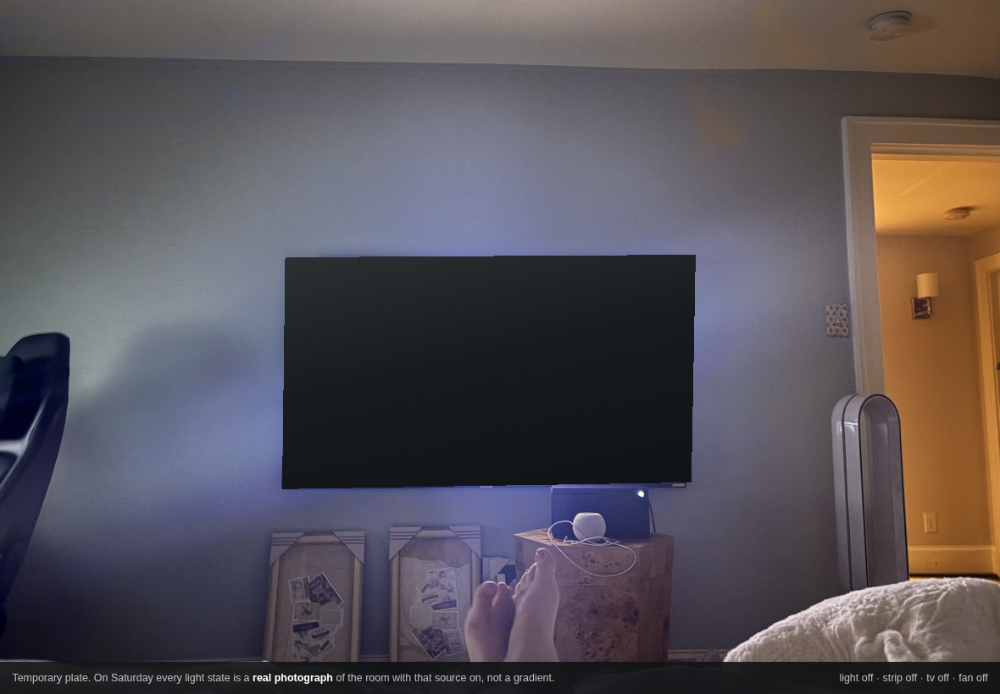
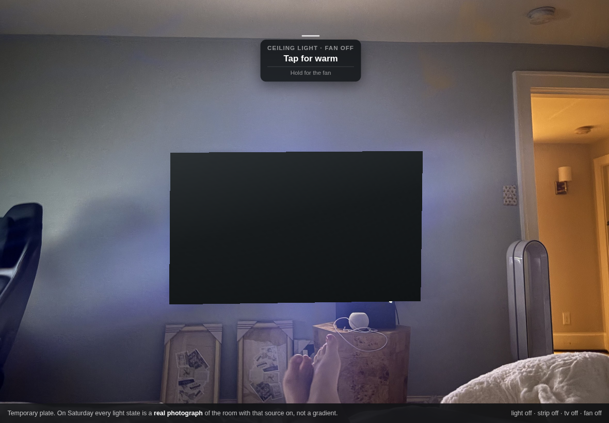
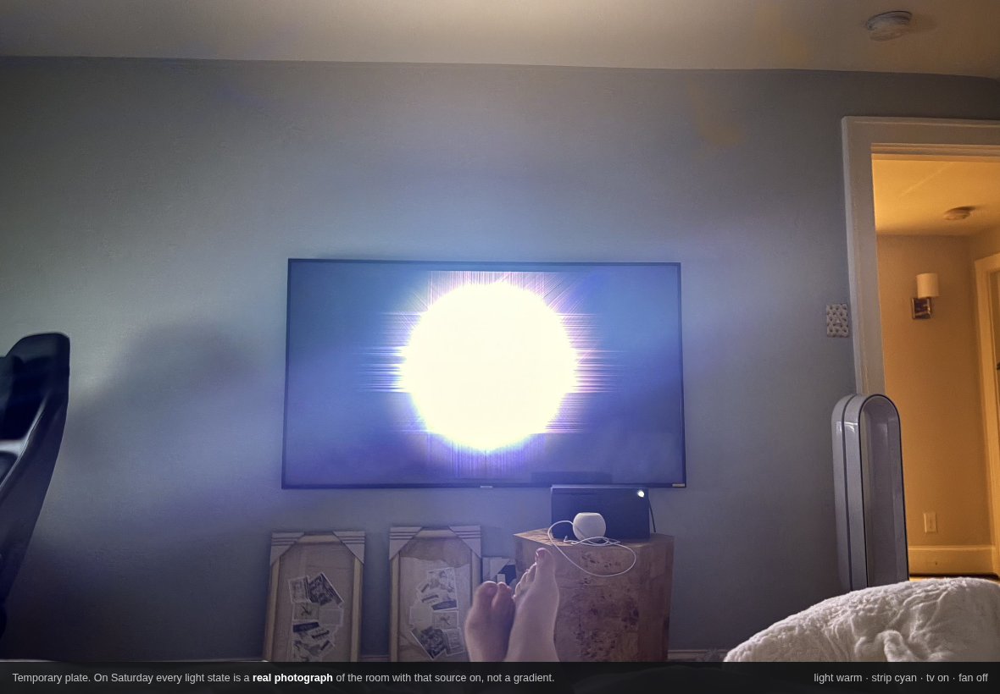
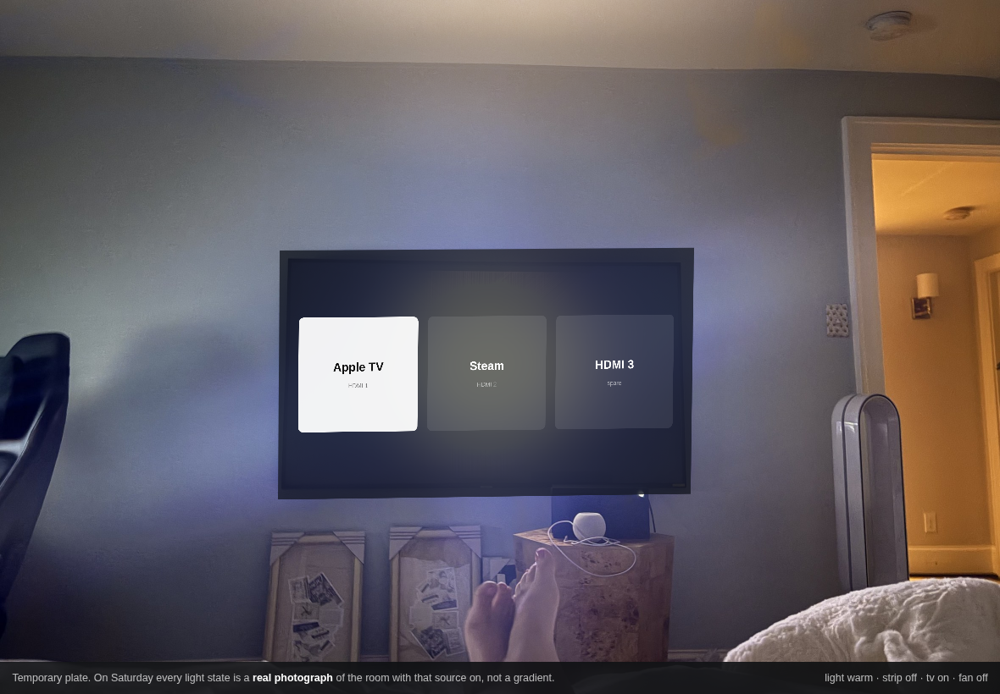

# For approval

The interaction design for the room page. Nine numbered items. Reply with the numbers
and what you want changed; anything you don't mention I'll take as approved.

**Open `demo.html` on the iPad and actually press things.** The screenshots are here so
you can skim on your phone, but this is an interaction design and interactions do not
screenshot. Tap the light, the TV, the strip, the Dyson. Hold them.

**One caveat, stated up front so nothing here is oversold.** The plate is the photo you
sent me, so the light states are *approximated* with gradients. On Saturday each one
becomes a real photograph of your room with that source on, differenced against the base
frame. The shape of the light in the demo is a guess. Everything else on the page,
the grammar, the caption, the timings, the picker, the maths that puts the picker on the
real TV, is final and is what ships.

---

## 1. Nothing is on the screen

No tiles, no cards, no status pills, no clock, no header. The room is the interface. The
TV is off in that shot and you can tell because the TV looks off, not because anything
says so.

This is the item everything else depends on, so it's the one worth disagreeing with
early if you're going to.

## 2. Tap advances, hold does one other thing

The whole grammar, one rule, every object:

- **Tap** moves to the next state. The photograph changes. That is the feedback.
- **Hold** does the object's single secondary thing.

Nothing is a menu. You asked for cycling and cycling is right, because the room already
shows you where you are, so a tap only has to move you one step.

## 3. The press caption

The only thing on screen that isn't your room, and it lives for exactly as long as your
finger is down.

It names where you are, what a tap will do, and what a hold will do. Then it's gone. A
friend who has never seen this can press anything and find out what it does without
committing to it, and you never look at a wall covered in labels.

The **bar above it fills over the half second the hold takes**, so a hold is never a
guess about whether it registered.

## 4. State is shown by the room, never by a label

Light warm, strip on, TV on. Nothing is annotated. Any colour in that picture means
something in the room is on.

## 5. The source picker, the one real UI

Inputs have names, and a name is the one thing that cannot be cycled blind, so this is
the single place a list exists.

It is **mapped onto the four corners of your actual TV**, so it lies in the plane of the
screen at the angle the camera caught it. That's a projective transform, not a rotate,
which is why it keystones correctly along with the panel.

**No icons.** The Apple logo is a private-use character that only renders if SF Pro is
installed and is a blank box everywhere else, and drawing a substitute would be putting
a fake logo on your wall. Three names at a size you can read from the bed is simpler,
more honest, and cannot break.

Names are guesses. **Tell me what's actually on each input.**

## 6. The cycles themselves

This is the item I most want feedback on, because it's the part that's your taste and
not my judgement.

| Object | Tap cycles | Hold |
|---|---|---|
| **Ceiling light** | Off → Warm → White | the fan: off → low → high |
| **TV** | Off → On | source picker |
| **Bias light** | Off → Warm → Cyan → Pink | dim |
| **Dyson** | Off → Low → High | oscillate |
| **PC** | wake. One action, no cycle | nothing |

Every ring is ordered so **off is one tap from wherever you leave it overnight**, rather
than three taps around a circle.

Open questions:

- Is **warm then white** the right order for the light, or do you reach for white first?
- Does the Karelia do **tunable white** at all? If it's one colour temperature, the
  light's cycle collapses to off/on and I'll simplify it.
- Four states on the strip is the most of anything here. Too many? I'd cut pink first.
- Should **hold on the TV** open the picker, or turn it off? Off is the more obvious
  meaning of a hold and the picker could be a second tap instead.

## 7. Where there is deliberately no UI

The PC is one tap and it wakes. No confirm, no panel, no options. It's not destructive
and you have a whole computer once it's on.

The Dyson has no visual state in a photograph, so it's the one object where the caption
is doing real work rather than confirming what you can already see.

## 8. Hold is 500ms

Long enough not to fire on a slow tap, short enough not to feel like waiting. It's one
constant and trivial to change, so if it feels wrong on the actual glass, say so and give
me "longer" or "shorter" rather than a number.

## 9. What I have not designed yet

Deliberately, because they need decisions from you first:

- **Scenes.** You asked for auto-deploying scenes off your patterns. I want the sensor
  in the room collecting for a few days before I guess at what your patterns are.
- **The desk view.** Second plate, second locked camera position, the PC on it.
- **Sonos.** Nothing above controls it. Play/pause on tap, volume on hold, is the obvious
  answer, but it has no visible state in the photo at all, which makes it the weakest fit
  for this whole grammar. Might be better as a genuinely separate thing.

---

## Also worth saying

I got page two wrong five times before this. All five were a grid of device tiles with a
different skin, and reskinning a dashboard just produces another dashboard. Your idea,
that the photo of the room should be the interface, is what fixed it, and it fixed it by
deleting the problem rather than by styling around it.

So the standard I'm holding this to is: **nothing on the screen that isn't either your
room or a direct answer to your finger being on it.** If you spot something that fails
that, that's the bug.
